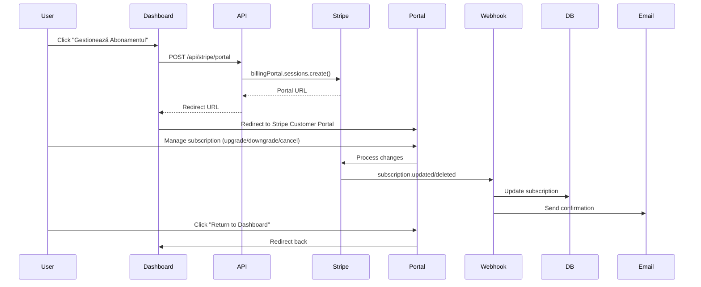

# Design: Pricing Navigation and Subscription Management UI

## Context

The Alex-Test platform has a fully functional Stripe subscription backend with three tiers (Free, Professional, Premium), comprehensive database schema, webhook handlers, and API routes. However, the user-facing components are incomplete, creating a poor user experience and reducing subscription conversion rates.

**Current State**:

- Pricing page exists at `/subscription-plans` but is hidden
- Backend subscription management is complete (`src/lib/stripe/subscriptions.ts`)
- No header navigation to pricing
- Artists cannot manage subscriptions in dashboard
- No enforcement of tier limits (bookings, portfolio items)
- No upgrade prompts when limits approached

**Constraints**:

- 400-line file size limit - split large components
- All database queries use Drizzle ORM (no raw SQL)
- Romanian localization required for all UI text
- Strict TypeScript (no `any` types)
- Server Components by default, `"use client"` only when needed

## Goals / Non-Goals

### Goals

1. Make pricing discoverable through header navigation
2. Display subscription status and provide easy access to Stripe Customer Portal
3. Enforce tier limits to drive upgrade conversions
4. Provide clear upgrade paths with benefit explanations
5. Send transactional emails for subscription events

### Non-Goals

- Multi-currency support (future enhancement)
- Subscription trials (future enhancement)
- Admin subscription management UI (separate task)
- Dunning/retry workflows (separate task)
- Analytics dashboard (separate task)

## Decisions

### 1. Navigation Placement

**Decision**: Add "Prețuri" between "Categorii" and "Despre Noi" in header.

**Rationale**:

- Logical flow: Home → Artists → Categories → **Pricing** → About → Contact
- Not too prominent (not next to logo) to avoid appearing pushy
- Accessible to all users (both authenticated and anonymous)
- Consistent with "show value before asking for signup" philosophy

**Alternatives Considered**:

- **Place in user menu**: Rejected - only visible to logged-in users, reduces discovery
- **Place next to "Devino Artist"**: Rejected - confusing context (pricing is for existing artists)
- **Separate CTA button**: Rejected - too prominent, feels sales-y for Romanian market

### 2. Subscription Management Architecture

**Decision**: Use React Server Components for data fetching, client components only for interactivity.

**Structure**:

```
src/app/artist/dashboard/page.tsx (Server Component)
  └─ Fetch current subscription data
  └─ Pass data to SubscriptionSection (Client Component)
      └─ SubscriptionStatusCard (Client Component)
          ├─ Display tier, status, dates, usage
          ├─ UsageIndicator (Client Component)
          └─ "Gestionează Abonamentul" button → Stripe Customer Portal
```

**Rationale**:

- Server Components reduce client bundle size
- Data fetching happens on server (faster, more secure)
- Client components only where needed (modals, buttons)
- API routes handle Stripe proration calculations

**Alternatives Considered**:

- **All client components**: Rejected - increases bundle size, exposes API keys risk
- **Separate subscription page**: Rejected - adds unnecessary navigation, dashboard is single source

### 3. Feature Gate Implementation

**Decision**: Dual enforcement - middleware checks + client-side UI gates.

**Layers**:

1. **Middleware** (`src/middleware.ts`): Server-side enforcement, blocks API requests
2. **Client Components**: UI-level gates, show upgrade prompts
3. **API Routes**: Double-check limits before database writes
4. **Database**: Track usage in `artist_subscriptions` table

**Rationale**:

- Defense in depth - no single point of failure
- Middleware blocks unauthorized API calls (security)
- Client UI provides better UX (prompts instead of errors)
- API checks prevent race conditions

**Alternatives Considered**:

- **Client-only gates**: Rejected - easily bypassed, security risk
- **Middleware-only gates**: Rejected - poor UX (no prompts or explanations)

### 4. Customer Portal Integration

**Decision**: Use Stripe Customer Portal for all subscription management (tier changes, cancellation, payment methods).

**Flow**:

1. User clicks "Gestionează Abonamentul" on subscription card
2. Application calls `/api/stripe/portal` to create session
3. User is redirected to Stripe Customer Portal
4. User manages subscription in Stripe (upgrade, downgrade, cancel, update payment)
5. User returns to dashboard via configured return URL
6. Webhooks update database with subscription changes

**Rationale**:

- Stripe Customer Portal is battle-tested and secure
- Handles all edge cases (proration, refunds, payment failures)
- No custom UI to maintain for complex billing scenarios
- Automatically updated with Stripe feature improvements
- Reduces development time significantly
- Artists trust Stripe's familiar interface for payment management

**Alternatives Considered**:

- **Custom tier change UI with proration preview**: Rejected - complex to build and maintain, prone to edge case bugs
- **Hybrid approach (some changes in-app, some in portal)**: Rejected - confusing UX, inconsistent experience

### 5. Email Notification Strategy

**Decision**: Send emails via Resend with React Email templates, triggered by webhook handlers.

**Events**:

- `customer.subscription.created` → Welcome email
- `invoice.payment_succeeded` → Renewal confirmation
- `invoice.payment_failed` → Payment failure alert
- Cron job daily → Check usage at 80% → Warning email

**Rationale**:

- Webhooks are reliable (Stripe retries failures)
- React Email templates are type-safe and maintainable
- Resend is already integrated in project
- Cron for usage warnings (not real-time, batched)

**Alternatives Considered**:

- **In-app notifications only**: Rejected - artists may not log in frequently
- **Real-time usage warnings**: Rejected - unnecessary API load, batching is acceptable

## Component Design Patterns

### SubscriptionStatusCard

**Purpose**: Display current subscription at a glance.

**Props**:

```typescript
interface SubscriptionStatusCardProps {
  subscription: {
    tier: { nameRo: string; priceMonthly: number; priceAnnual: number };
    status: "active" | "past_due" | "canceled" | "trialing";
    currentPeriodEnd: Date;
    billingPeriod: "monthly" | "annual";
  } | null;
  usage: {
    bookingsThisMonth: number;
    maxBookings: number;
    portfolioItems: number;
    maxPortfolioItems: number;
  };
}
```

**Layout**:

- Card with tier badge (Free/Pro/Premium)
- Status indicator (green dot = active, red = past_due)
- Billing info: "Următoarea plată: 15 Dec 2025 - 49 RON"
- Usage bars: "5 / 20 rezervări folosite luna aceasta"
- Single action button: "Gestionează Abonamentul" (redirects to Stripe Customer Portal)

### UsageIndicator

**Purpose**: Visual progress bar for tier limits.

**Variants**:

- `normal` (0-79%): Blue progress bar
- `warning` (80-99%): Yellow progress bar with warning icon
- `exceeded` (100%): Red progress bar with lock icon

**Behavior**:

- Click to open upgrade modal (if not at max tier)
- Tooltip shows exact numbers on hover
- Animated when usage changes

## Data Flow

### Subscription Status Fetch

```typescript
// Server Component (app/artist/dashboard/page.tsx)
const subscription = await getArtistSubscription(artistId);
const usage = await getArtistUsage(artistId);

return <SubscriptionSection subscription={subscription} usage={usage} />;
```

### Subscription Management Flow



### Feature Gate Check

```typescript
// Middleware (src/middleware.ts)
export async function middleware(req: NextRequest) {
  if (req.url.includes("/api/bookings") && req.method === "POST") {
    const user = await getUser(req);
    const canCreate = await canCreateBooking(user.artistId);
    if (!canCreate) {
      return NextResponse.json(
        { error: "Ai atins limita de rezervări pentru planul tău" },
        { status: 403 }
      );
    }
  }
}

// Client Component (CreateBookingButton.tsx)
("use client");
const handleClick = async () => {
  const check = await checkFeatureAccess("create_booking");
  if (!check.allowed) {
    showUpgradeModal(check.requiredTier);
    return;
  }
  // Proceed with booking creation
};
```

## Database Schema Updates

No schema changes required. Existing tables are sufficient:

- `artist_subscriptions` - Stores subscription records
- `subscription_tiers` - Tier definitions
- `payment_transactions` - Payment history
- `stripe_webhook_events` - Webhook log

## Security Considerations

1. **Subscription Status Verification**: Always verify subscription status from database, not client input
2. **Proration API Protection**: Require authentication, validate artistId matches session user
3. **Feature Gate Bypass Prevention**: Middleware checks before API routes, API routes check again before DB writes
4. **Stripe Checkout Security**: Use metadata to store artistId, verify on webhook
5. **Customer Portal Session**: One-time use, 30-minute expiry

## Performance Considerations

1. **Subscription Caching**: Use Next.js `unstable_cache` with 5-minute TTL for subscription status
2. **Tier Caching**: Use Next.js `unstable_cache` with 1-hour TTL for tier definitions
3. **Proration Fetching**: Not cached (always fresh), but acceptable since user-initiated
4. **Usage Tracking**: Denormalized counts in `artist_subscriptions` table, updated on booking creation/deletion
5. **Bundle Size**: Keep subscription UI components under 400 lines, code-split modals

## Migration Plan

1. **Phase 1**: Add header navigation (no backend changes)
2. **Phase 2**: Create subscription status card (read-only)
3. **Phase 3**: Add Customer Portal integration button
4. **Phase 4**: Implement feature gates for bookings
5. **Phase 5**: Implement feature gates for portfolio
6. **Phase 6**: Add email notifications

**Rollback Strategy**: Each phase is independent. If issues arise, disable feature via feature flag without code rollback.

## Open Questions

1. **Should free tier artists see "Upgrade" prompts before hitting limits?**
   - Proposed: Yes, show soft prompts in dashboard, hard prompts at limit
2. **How to handle artists on old/deprecated tiers?**
   - Proposed: Grandfather them, show "Legacy Plan" badge, allow upgrade but not downgrade
3. **Email notification frequency for usage warnings?**
   - Proposed: Once per month at 80%, once per month at 90%, daily at 100%
4. **Should artists on past_due status have immediate feature restriction?**
   - Proposed: Grace period of 3 days (show banner), then restrict to free tier features
